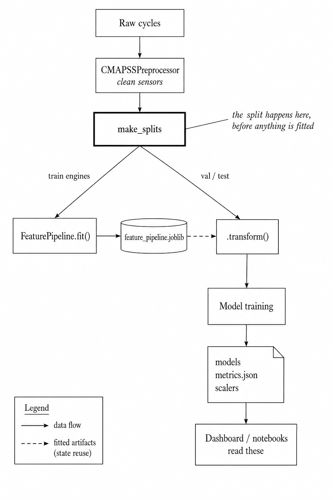

# NASA Turbofan Twin: Predictive Maintenance for Jet Engines

Predicting how many flight cycles a turbofan engine has left, from raw sensor data through to an interactive dashboard.

The data is NASA's CMAPSS FD001 benchmark: 100 simulated engines, 21 sensor channels each, every one of them run until they fail.

This project served the purpose to work through a clean data science lifecycle end to end within 8 weeks for self-educational purposes.
Below I am documenting that process, including the parts I got wrong the first time, because those turned out to be the more useful half of the exercise.

---

## Quickstart

```bash
git clone <repository-url>
cd NASA-Turbofan-Twin

python -m venv venv
source venv/bin/activate          # Windows: venv\Scripts\activate
pip install -r requirements.txt

python -m src.train               # raw data to trained models, about 3 minutes
streamlit run webapp/dashboard.py
```

That one training command rebuilds everything: cleaned data, features, all six models, the survival models, and the metrics file the rest of the project reads from.
It writes into `data/models/cmapss/`, which I keep gitignored, since trained models are build output rather than something worth versioning.
Do `--skip-lstm` to drop the slow stage.

To run the tests:

```bash
pip install -r requirements-dev.txt
pytest
```

---

## Results

Everything below is measured on the 15 test engines I kept out of both training and model selection.
The numbers come from `data/models/cmapss/metrics.json`, which the training run writes.

| Model | Test R2 | Test MAE | Test RMSE | NASA score | Validation R2 |
|---|---|---|---|---|---|
| LSTM | 0.8270 | 12.82 | 17.35 | 15,301 | 0.8470 |
| Gradient Boosting | 0.8119 | 13.42 | 18.09 | 34,466 | 0.8289 |
| Random Forest | 0.8027 | 14.22 | 18.52 | 34,807 | 0.8256 |
| Ridge | 0.7563 | 16.63 | 20.59 | 25,437 | 0.8099 |
| Linear Regression | 0.7563 | 16.61 | 20.59 | 25,775 | 0.8085 |
| Lasso | 0.7332 | 17.56 | 21.54 | 29,518 | 0.7941 |

The survival models get a concordance index instead, since they rank risk rather than predict a number:

| Model | Test C-index | Validation C-index | Train C-index |
|---|---|---|---|
| Weibull AFT | 0.611 | 0.889 | 0.707 |
| Cox PH | 0.579 | 0.878 | 0.703 |

Two caveats I would rather state myself than have someone find.

Validation comes out higher than test for every single model, and it should.
Validation is what picked my alphas and what I used to decide which model I preferred, so by the time I read it, it has already been optimised against.
The gap between those two columns is roughly what that selection costs, which is why I print both instead of just the better one.

The test set is also only 15 engines.
The distance between my top three models is not much bigger than the noise I would expect from a sample that size, so the LSTM winning is suggestive rather than settled.
Cross validation over engine folds would probably answer it properly and I have not done that yet.

---

## Architecture

### Data layers

I never touch the raw files.
Everything below them is derived, and I can delete the lot and rebuild it.

```
data/bronze/    raw CMAPSS text files, tracked in git, never written to
data/silver/    cleaned: constant, low variance and redundant sensors removed
data/gold/      engineered and normalised feature matrix, model ready
data/models/    trained models, fitted transformers, split, metrics
```

Only bronze is committed.
Everything under it comes back from the training script.

### Module map

| File | Responsibility |
|------|----------------|
| `src/data_loader.py` | Read raw files, attach the RUL label for train and test splits |
| `src/preprocessor.py` | Sensor cleaning and the stateless feature formulas |
| `src/splits.py` | Engine level train/val/test split, written to disk as an artifact |
| `src/pipeline.py` | `FeaturePipeline`: stateless features plus the fitted correlation filter and scaler |
| `src/feature_engineering.py` | Serving path, loads the fitted pipeline and applies it |
| `src/survival.py` | Landmark survival design, Weibull AFT and Cox PH |
| `src/train.py` | The one command that runs all of it and writes metrics |
| `webapp/dashboard.py` | Streamlit app, reads artifacts only |

### Keeping training and serving in step

This is something I had to learn it by making the same mistake in three different places.

A saved model on its own is not enough to predict with.
You also need everything fitted alongside it: which features survived selection, the min and max used to scale them, the standardiser the LSTM expects, the order the columns arrive in.
When any of that only exists as a line in a notebook, the serving code has to reimplement it from memory, and the two versions drift apart silently, because nothing raises when they disagree. You just quietly get worse predictions.

So I made the training run write all of it out together:

```
data/models/cmapss/
  feature_pipeline.joblib   fitted feature set, correlation filter, scaler
  splits.json               which engines are train, val and test
  metrics.json              validation and test scores, plus residual quantiles
  lstm_scaler.joblib        the standardiser the LSTM was fit with
  lstm_features.json        its feature subset and sequence length
  *.pkl / *.keras           the models themselves
```

and serving loads exactly those.
`src/feature_engineering.py` has no feature formulas in it any more, it just applies the pipeline that training saved, so there is one implementation and nothing for it to disagree with.

I did the same thing for numbers with `metrics.json`.
The dashboard, the notebooks and the results table above all read from it rather than keeping private copies, which is what they used to do, and those copies had already drifted out of agreement with each other.



---

## Working Through the Lifecycle

What follows is each stage in the order I worked through it, what I was trying to achieve, and where I changed my mind.
A fair number of these got rebuilt after I went back through the repo properly and realised I had the right stages in the wrong order.

### Framing the problem

RUL prediction is regression, but the cost of being wrong is lopsided.
If I tell a maintenance team an engine has more life left than it does, they can end up with an aircraft crashing somewhere; if I tell them it has less, they replace a serviceable engine early and waste money.
MAE and R2 score those two mistakes identically, so I report the CMAPSS NASA score next to them, which punishes the optimistic direction on a steeper curve.

I also clip RUL at 125 cycles after inspecting historic RUL graphs.
An engine with 200 cycles left and one with 190 are both just healthy, and nobody schedules anything differently between them, so making the model learn that distinction spends capacity on something no one acts on.

### Loading the data

Raw files get read once and never written back to.
Training engines get RUL from their own last cycle; test engines get theirs from the truth file NASA ships alongside.

When I came back to this I found the test loader had never actually worked.
It crashed on a merge that collided on a column name, and underneath that its RUL formula subtracted from the fleet-wide maximum cycle rather than each engine's own, which would have inflated the label for every engine except the longest-lived one.
I fixed both, and now check the result against `RUL_FD001.txt` directly rather than against a number I picked to make the test pass.

### Exploration

I looked at sensor distributions, correlation structure, degradation traces for individual engines, and how each sensor drifts across normalised engine life.

The useful output of this stage was not the plots, it was the list of sensors to throw away.
Four are completely constant, three barely move, and one is over 0.95 correlated with another, so eight columns were removed before I started modelling.

### Cleaning

Those get dropped and the result written to the silver layer.
I kept cleaning separate from feature engineering so that changing a cleaning rule does not force me to rerun the expensive part.

### Splitting, before anything gets fitted

I originally had this wrongfully backwards.

The rows are cycles, not independent observations.
Two rows from the same engine share rolling windows, lag features and one continuous degradation curve, so splitting rows at random scatters near-duplicates across both sides and gives me a score that says nothing about how the model handles an engine it has never seen.
That is why I split by engine.

The part I got wrong was the ordering.
In the first version I normalised and correlation-filtered the entire dataset and only split afterwards, which meant the scaler's min and max, and my choice of which features to keep, had both already looked at the held out engines.
Once I moved the split ahead of the fitting, the scores came down, which is exactly what should happen.

I also started writing the split to `splits.json` so everything reads it from one place.
I found that my two modelling notebooks each computed what I claimed the same split, one shuffling the engine IDs and one sorting them.
Engines held out from the tree models were sitting inside the LSTM's training set, so every comparison I had made between the two was measured on different data.

### Feature engineering

Rolling mean, standard deviation, min and max at 5, 10 and 20 cycle windows; lags at 1, 3 and 5; first difference and a rolling least-squares slope; EWMA at three spans.
All of them are computed inside a single engine's own history, which is what makes it safe to build them before splitting.

My reasoning was that one sensor reading tells you where an engine currently sits, but degradation is about where it is heading, and that only shows up across a window.

The correlation filter then drops 121 of the 276 candidates, since features built this way correlate heavily by construction.

### Baselines first

Linear regression, then Ridge, then Lasso, then Random Forest, then Gradient Boosting, then the LSTM.

I did not put the baselines in to compete.
They are there so the expensive models have something concrete to beat, and so I can see what the problem gives me for free.
As it turned out, the whole journey from linear regression to the LSTM is worth about 0.07 R2, bought with a large increase in training time and the loss of any direct way to explain a prediction.
That felt worth knowing before reaching for a sequence model.

### Tuning on validation, reporting on test

Three splits doing three jobs: train fits, validation selects, test gets looked at once at the very end.

My first version built a test set and then never scored anything on it, which is why `test_r2` was sitting at `null` in the metadata for every tree model.
The number I had been quoting everywhere was a validation score that had also chosen the model, and a number cannot both make a decision and measure it.

### Survival analysis, asked properly

Weibull AFT and Cox proportional hazards: watch each engine to cycle 100, build the covariates only from that window, then model the time remaining after it, right censored at a horizon.

The version before this built its covariates from the last 30 cycles before failure and predicted total lifetime, which amounts to reading the end of the story to work out how long the story was.
It also reported `concordance_index_`, which is the training concordance, as though it were a generalisation result.
Fixing both dropped the reported figure from 0.85 to 0.611, and that drop is the honest outcome rather than a regression.

Censoring mattered here too.
With every engine running to failure my event column was a constant 1, and survival analysis with nothing censored is really just regression.
Cutting observation off at a horizon gave that column some meaning.

### Interpretability

Feature importance from both tree models, averaged so I am looking at what they agree on, plus SHAP for individual predictions.
A maintenance recommendation that cannot point at a sensor is not one anybody is going to act on.

### Uncertainty that is actually measured

Prediction intervals now come from each model's own residual quantiles on the held out engines, which the training run records for exactly this purpose.

They used to come out of `np.random.normal`, scaled off the prediction itself, with the same percentile used for both bounds, and the UI labelled the result "95% confidence".
That one bothered me more than anything else I found, because an interval that is invented is worse than no interval at all (costly in practice/industry as the invented interval might be part of any planning process).

### Serving

The dashboard loads artifacts and does no feature engineering of its own.
Every number on screen is read from `metrics.json` rather than stored in the app, because the app's own copies had already fallen out of step with both the metadata and this README.

### Reproducibility

`python -m src.train` goes from raw files to models and metrics in one go.
I added upper bounds to the dependencies after a pandas 3 upgrade silently broke two feature builders that nothing outside a notebook imported.

The tree models come back identical from the seed.
TensorFlow on CPU does not, so the LSTM moves by roughly a point of R2 between environments, which I would rather write down than ignore.

### Tests and CI

A pytest suite over the data and feature layer (running on every push on github actions as well).

The RUL definitions for both splits, engine boundaries in the lag and window features, whether the split is disjoint and deterministic, and a leakage test that mutates the held out engines and checks that nothing the pipeline learned moves.
Warnings fail the build, since the pandas deprecation that broke everything had been printing quietly into a notebook for two releases while I ignored it.

Model training stays out of CI, and the tests that check training and serving agree skip themselves when there is nothing trained to check.

---

## What I Would Do Next

Evaluating on the official FD001 test split, and reporting RMSE and the NASA score, would make these results comparable with published CMAPSS work. My internal split answers a slightly different question.

Cross validation over engine folds is the obvious gap. Fifteen test engines is not enough to separate the top three models with any confidence.

FD002 and FD004 introduce multiple operating conditions, which would need condition-aware normalisation rather than the single global scaler I use here.

Drift monitoring would be cheap to add. The pipeline already stores the training min and max, so an input distribution wandering away from it is measurable, and right now nothing measures it.

---

## Dashboard

```bash
streamlit run webapp/dashboard.py
```

| Page | What it shows |
|------|---------------|
| Overview | Held out scores, and which model answers which question |
| New Prediction | CSV upload or manual sensor entry, with intervals and SHAP |
| Engine Analysis | One engine, all models, survival curve, sensor traces |
| Model Comparison | Validation against test, and the gap between them |
| Fleet Management | Risk ranking and maintenance priority across the fleet |
| Performance Metrics | Residual distributions, cost and interpretability trade-offs |
| Workflow | The pipeline, and what was wrong with the first version |

The evaluation pages show only the held out engines.
They used to run on the full featured file, which meant most of what I was scoring and ranking was training data being presented as though it were not.


---

## Repository Layout

```
data/bronze/     raw CMAPSS files, tracked, never written to
data/silver/     cleaned sensor cycles
data/gold/       engineered and normalised feature matrix
data/models/     models, fitted transformers, split, metrics

src/             the pipeline
notebooks/       the narrative: EDA, modelling, survival, deep learning
webapp/          Streamlit dashboard
tests/           pytest suite
```

## Notebooks

The notebooks are where my reasoning lives; `src/train.py` is the part that reproduces.
They run the same pipeline and read the same split and pipeline artifacts, so they cannot quietly disagree with it any more.

| Notebook | Contents |
|----------|----------|
| `01_eda_cmapss` | Sensor distributions, correlations, degradation traces |
| `02_preprocessing` | Cleaning, and which sensors get dropped and why |
| `02.5_feature_engineering` | Rolling, lag, trend and EWMA features, with plots |
| `03-04_machine_learning_models` | Split, baselines, tree models, test evaluation |
| `05_survival_analysis` | Landmark design, Weibull AFT and Cox PH |
| `06_deep_learning` | LSTM on sequences, compared on the same split |

## Dataset

NASA CMAPSS, FD001 subset: 100 engines under a single operating condition and a single fault mode.
Each engine starts with some unknown amount of initial wear and runs to failure, giving 21 sensor channels and 3 operational settings, one row per cycle.

FD002 and FD004 add multiple operating conditions, which is why they are on my future work list rather than in the repo: a single global scaler is the wrong tool for them.

## Tools

`pandas` and `numpy` for data handling, `scikit-learn` for the tree and linear models, `TensorFlow` for the LSTM, `lifelines` for survival analysis, `SHAP` for explanations, `Streamlit` and `Plotly` for the dashboard, and `pytest` for the tests.
