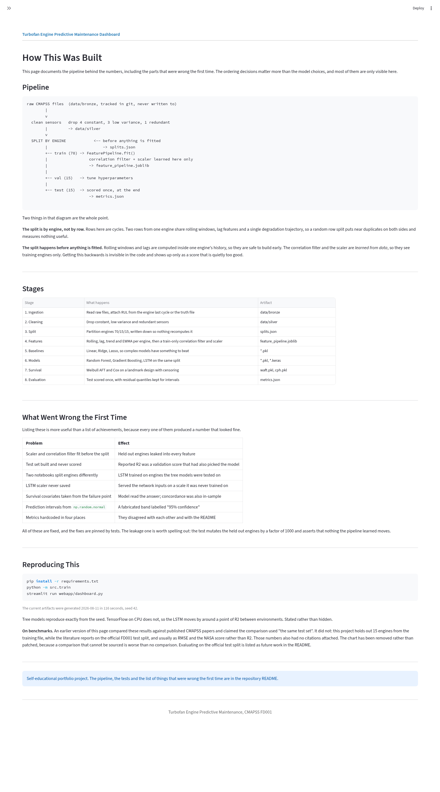

# NASA Turbofan Twin: Predictive Maintenance for Jet Engines

Predicting the Remaining Useful Life (RUL) of turbofan engines from run-to-failure sensor data, end to end: raw files through to a served dashboard.

The dataset is NASA's CMAPSS FD001 benchmark, 100 simulated engines run to failure across 21 sensor channels.
The models themselves are ordinary. What this project is actually about is the pipeline discipline around them, so that is what most of this README covers.

**This project is for self-educational purposes.**

---

## Quickstart

```bash
git clone <repository-url>
cd NASA-Turbofan-Twin

python -m venv venv
source venv/bin/activate          # Windows: venv\Scripts\activate
pip install -r requirements.txt

python -m src.train               # raw data to trained models, about 3 minutes
streamlit run webapp/dashboard.py
```

`python -m src.train` is the only command needed to reproduce every model and every number below.
It writes to `data/models/cmapss/`, which is gitignored because trained models are build output rather than source.
Pass `--skip-lstm` to skip the slowest stage.

Tests:

```bash
pip install -r requirements-dev.txt
pytest
```

---

## Results

All figures are on the held out test engines, which were not used for fitting or for model selection.
They come from `data/models/cmapss/metrics.json`, written by the training run.

| Model | Test R2 | Test MAE | Test RMSE | NASA score | Validation R2 |
|---|---|---|---|---|---|
| LSTM | 0.8270 | 12.82 | 17.35 | 15,301 | 0.8470 |
| Gradient Boosting | 0.8119 | 13.42 | 18.09 | 34,466 | 0.8289 |
| Random Forest | 0.8027 | 14.22 | 18.52 | 34,807 | 0.8256 |
| Ridge | 0.7563 | 16.63 | 20.59 | 25,437 | 0.8099 |
| Linear Regression | 0.7563 | 16.61 | 20.59 | 25,775 | 0.8085 |
| Lasso | 0.7332 | 17.56 | 21.54 | 29,518 | 0.7941 |

Survival models, scored by concordance index on held out engines:

| Model | Test C-index | Validation C-index | Train C-index |
|---|---|---|---|
| Weibull AFT | 0.611 | 0.889 | 0.707 |
| Cox PH | 0.579 | 0.878 | 0.703 |

Two things worth reading carefully.

**Validation is always higher than test.** Validation chose the hyperparameters and the preferred model, so its score is optimistic by construction. The gap is the cost of that selection. Quoting the validation number as a generalisation estimate is the most common way a project like this overstates itself, and an earlier version of this repo did exactly that.

**The test split is 15 engines.** The gaps between the top three models are comparable to the uncertainty in the estimates themselves. The LSTM leads, but not by enough to call it settled on this evidence.

---

## Architecture

### Data layers

Raw data is never modified in place. Each layer is derived from the one above it and can be rebuilt from scratch.

```
data/bronze/    raw CMAPSS text files, tracked in git, never written to
data/silver/    cleaned: constant, low variance and redundant sensors removed
data/gold/      engineered and normalised feature matrix, model ready
data/models/    trained models, fitted transformers, split, metrics
```

Only bronze is committed. Everything below it is reproducible output, which is the test of whether the pipeline actually works.

### Module map

| File | Responsibility |
|------|----------------|
| `src/data_loader.py` | Read raw files, attach the RUL label for train and test splits |
| `src/preprocessor.py` | Sensor cleaning and the stateless feature formulas |
| `src/splits.py` | Engine level train/val/test split, written to disk as an artifact |
| `src/pipeline.py` | `FeaturePipeline`: stateless features plus the fitted correlation filter and scaler |
| `src/feature_engineering.py` | Serving path, loads the fitted pipeline and applies it |
| `src/survival.py` | Landmark survival design, Weibull AFT and Cox PH |
| `src/train.py` | The one command that runs all of it and writes metrics |
| `webapp/dashboard.py` | Streamlit app, reads artifacts only |

### The artifact boundary

This is the part worth explaining, because getting it wrong was the source of most of the bugs this project has had.

A trained model on its own is not servable. What makes a prediction reproducible is the model **plus every transformation fitted alongside it**: which features survived selection, the min and max used to normalise them, the standardiser the LSTM expects, the exact column order. If any of that lives only in a notebook cell, the serving path has to reimplement it, and the two implementations drift.

So training writes all of it:

```
data/models/cmapss/
  feature_pipeline.joblib   fitted feature set, correlation filter, scaler
  splits.json               which engines are train, val and test
  metrics.json              validation and test scores, plus residual quantiles
  lstm_scaler.joblib        the standardiser the LSTM was fit with
  lstm_features.json        its feature subset and sequence length
  *.pkl / *.keras           the models themselves
```

and serving loads them. `src/feature_engineering.py` does not contain a single feature formula, it just calls the pipeline that training saved. There is one implementation, so it cannot disagree with itself.

`metrics.json` plays the same role for numbers. The dashboard, the notebooks and the results table below all read from it rather than hardcoding values, because every hardcoded metric in this repo had already gone stale.

```
raw cycles
    |
    v
CMAPSSPreprocessor        clean sensors
    |
    v
make_splits               <-- split happens HERE, before anything is fitted
    |
    +---> train engines --> FeaturePipeline.fit()  --> feature_pipeline.joblib
    |                              |
    |                              v
    +---> val / test -------> .transform() ---------> model training
                                                          |
                                                          v
                                          models + metrics.json + scalers
                                                          |
                                     dashboard / notebooks read these
```

---

## The Lifecycle, Stage by Stage

Each stage below says what it is for, what this project does, and where the interesting decision was.
Most of these were rebuilt after an audit found the first version had the right stages in the wrong order.

### 1. Framing

RUL prediction is a regression problem with an asymmetric cost.
Predicting an engine has more life left than it does strands an aircraft; predicting too little wastes a serviceable engine.
Symmetric metrics like MAE and R2 do not see that, so the CMAPSS NASA score is reported alongside them: it penalises late predictions on a steeper exponential than early ones.

RUL is also clipped at 125 cycles.
A healthy engine is simply healthy, and forcing the model to distinguish 200 remaining cycles from 190 spends capacity on a distinction nobody acts on.

### 2. Ingestion

Raw files are read once and never written back to.
The train split gets RUL from each engine's own last cycle; the test split gets it from NASA's truth file.

The test loader had two bugs that meant it had never run: a merge that collided on a column name, and a formula that subtracted from the fleet-wide maximum cycle instead of the engine's own.
It is now asserted against `RUL_FD001.txt` rather than against a value chosen to make the test pass.

### 3. Exploration

Sensor distributions, correlation structure, per-engine degradation traces, and how each sensor moves across normalised engine life.
This is where the sensor drops come from: four channels are constant, three are near constant, one is redundant with another above 0.95 correlation.

EDA earns its place by producing decisions, not plots. Those eight dropped columns are the output.

### 4. Cleaning

Constant, low variance and highly correlated sensors are removed, and the result is written to the silver layer.
Cleaning is separated from feature engineering so the expensive step does not have to rerun when a cleaning rule changes.

### 5. Splitting, which comes before feature fitting

The single most important ordering decision in the project.

Rows here are cycles, not independent samples. Two rows from the same engine share rolling windows, lag features and one continuous degradation curve, so a random row split puts near-duplicates on both sides and reports a number that has nothing to do with a new engine. The split is therefore by **engine**.

It also has to happen **before anything is fit**.
The first version normalised and correlation-filtered the whole dataset and split afterwards, which meant the scaler's min and max, and the choice of which features to keep, both encoded the held out engines.

The split is written to `splits.json` and every consumer reads it.
That is not ceremony: the two modelling notebooks previously computed "the same" split with different code, one shuffled and one sorted, so engines held out from the tree models were inside the LSTM's training set and every comparison between them was measured on different data.

### 6. Feature engineering

Rolling mean, standard deviation, min and max over 5, 10 and 20 cycle windows; lags at 1, 3 and 5; first difference and rolling least-squares slope; EWMA at three spans.
All computed within an engine, which is what makes them safe to build before the split.

A single sensor reading says where the engine is. Degradation is about where it is *going*, which is what the trend and rolling features encode.

The correlation filter then removes 121 of the 276 candidates, because these features are highly redundant by construction.

### 7. Baselines before complexity

Linear regression, then Ridge, then Lasso, then Random Forest, then Gradient Boosting, then an LSTM.

The point of the linear baseline is not to win. It is to establish what the problem gives you for free, so the deep model has to justify its cost against something rather than against nothing. Here that gap is real but modest: about 0.07 R2 from linear regression to the LSTM, for a large jump in training cost and a total loss of direct interpretability.

### 8. Tuning on validation, reporting on test

Three splits, used for three different things.
Train fits, validation selects, test is scored exactly once at the end.

The first version built a test set and never scored it, so `test_r2` was null for every tree model and the reported figure was a validation score that had also chosen the model. A number used to make a choice cannot also measure that choice.

The gap between the two columns in the results table is the cost of selection, and it is the honest thing to report.

### 9. Survival analysis, framed so it can answer a question

Weibull AFT and Cox proportional hazards, on a landmark design: observe each engine to cycle 100, build covariates only from that window, and model the time remaining after it, right censored at a horizon.

The original version built covariates from the last 30 cycles *before failure* and predicted total lifetime, which is reading the end of the story to predict its length. It also reported `concordance_index_`, the training concordance, as if it were a generalisation number.

Censoring matters here. With every engine run to failure the event column was a constant 1, which turns survival analysis into ordinary regression with extra machinery. The horizon makes censoring real, which is the only reason to reach for these models at all.

### 10. Interpretability

Feature importance from both tree models, averaged for consensus, and SHAP for individual predictions.
A maintenance recommendation that cannot say which sensor drove it does not get acted on.

### 11. Uncertainty that means something

Prediction intervals come from the model's own held out residual quantiles, stored in `metrics.json` at training time.

They previously came from `np.random.normal` scaled off the prediction itself, with the 2.5th percentile used for both bounds, and were labelled "95% confidence" in the UI. A fabricated interval is worse than no interval, because it invites decisions.

### 12. Serving

The dashboard loads artifacts and does no feature engineering of its own.
It reads `metrics.json` for every number it displays rather than holding its own copies, which had already drifted out of agreement with both the metadata and the README.

### 13. Reproducibility

`python -m src.train` goes from raw files to models and metrics in one command.
Dependencies carry upper bounds, added after a pandas 3 upgrade silently broke two feature builders that nothing outside a notebook imported.

Tree models reproduce exactly from the seed. TensorFlow on CPU does not, and the LSTM test R2 moves by around a point between runs, which is stated rather than papered over.

### 14. Tests and CI

pytest on the data and feature layer, running on every push.

The suite is aimed at the failures this project actually had: the RUL definitions, engine boundary handling in lag and window features, split disjointness and determinism, and a leakage test that mutates the held out engines and asserts nothing the pipeline learned moves. Warning filters are set to `error`, because the pandas deprecation that broke the pipeline had been printing a warning into a notebook nobody read for two releases.

Model training stays out of CI. The artifact tests that check training and serving agree are skipped when nothing has been trained.

---

## What I would do next

- Evaluate on the official FD001 test split, and report RMSE and NASA score so results are comparable to published CMAPSS work. The internal split answers a different question.
- Cross validation over engine folds. Fifteen test engines is a small sample and the confidence interval on that R2 is wider than the gaps between the top three models.
- Extend to FD002 and FD004, which have multiple operating conditions and need condition-aware normalisation.
- Monitor feature drift in serving. The pipeline stores training min and max, so an input distribution moving away from it is measurable, and nothing currently measures it.

---

## Dashboard

```bash
streamlit run webapp/dashboard.py
```

| Page | What it shows |
|------|---------------|
| Overview | Held out scores, and which model answers which question |
| New Prediction | CSV upload or manual sensor entry, with intervals and SHAP |
| Engine Analysis | One engine, all models, survival curve, sensor traces |
| Model Comparison | Validation against test, and the gap between them |
| Fleet Management | Risk ranking and maintenance priority across the fleet |
| Performance Metrics | Residual distributions, cost and interpretability trade-offs |
| Workflow | The pipeline, and what was wrong with the first version |

The dashboard loads artifacts and does no feature engineering of its own.
Every number it displays is read from `metrics.json`, not stored in the app.

Evaluation pages show only the held out engines. They previously ran on the full featured file, so about 70 percent of what was being scored and risk ranked was training data presented as held out.




---

## Repository Layout

```
data/bronze/     raw CMAPSS files, tracked, never written to
data/silver/     cleaned sensor cycles
data/gold/       engineered and normalised feature matrix
data/models/     models, fitted transformers, split, metrics

src/             the pipeline
notebooks/       the narrative: EDA, modelling, survival, deep learning
webapp/          Streamlit dashboard
tests/           pytest suite
```

## Notebooks

The notebooks are the reasoning; `src/train.py` is the reproducible path.
Both run the same pipeline, and the notebooks read the same split and pipeline artifacts, so they cannot disagree with it.

| Notebook | Contents |
|----------|----------|
| `01_eda_cmapss` | Sensor distributions, correlations, degradation traces |
| `02_preprocessing` | Cleaning, and which sensors get dropped and why |
| `02.5_feature_engineering` | Rolling, lag, trend and EWMA features, with plots |
| `03-04_machine_learning_models` | Split, baselines, tree models, test evaluation |
| `05_survival_analysis` | Landmark design, Weibull AFT and Cox PH |
| `06_deep_learning` | LSTM on sequences, compared on the same split |

## Dataset

NASA CMAPSS, FD001 subset: 100 engines, single operating condition, single fault mode.
Each engine starts with unknown initial wear and runs to failure.
21 sensor channels plus 3 operational settings, one row per cycle.

FD002 and FD004 add multiple operating conditions and are listed under future work, since they need condition-aware normalisation rather than a single global scaler.

## Tools

`pandas` and `numpy` for data, `scikit-learn` for the tree and linear models, `TensorFlow` for the LSTM, `lifelines` for survival analysis, `SHAP` for explanations, `Streamlit` and `Plotly` for the dashboard, `pytest` for the suite.
