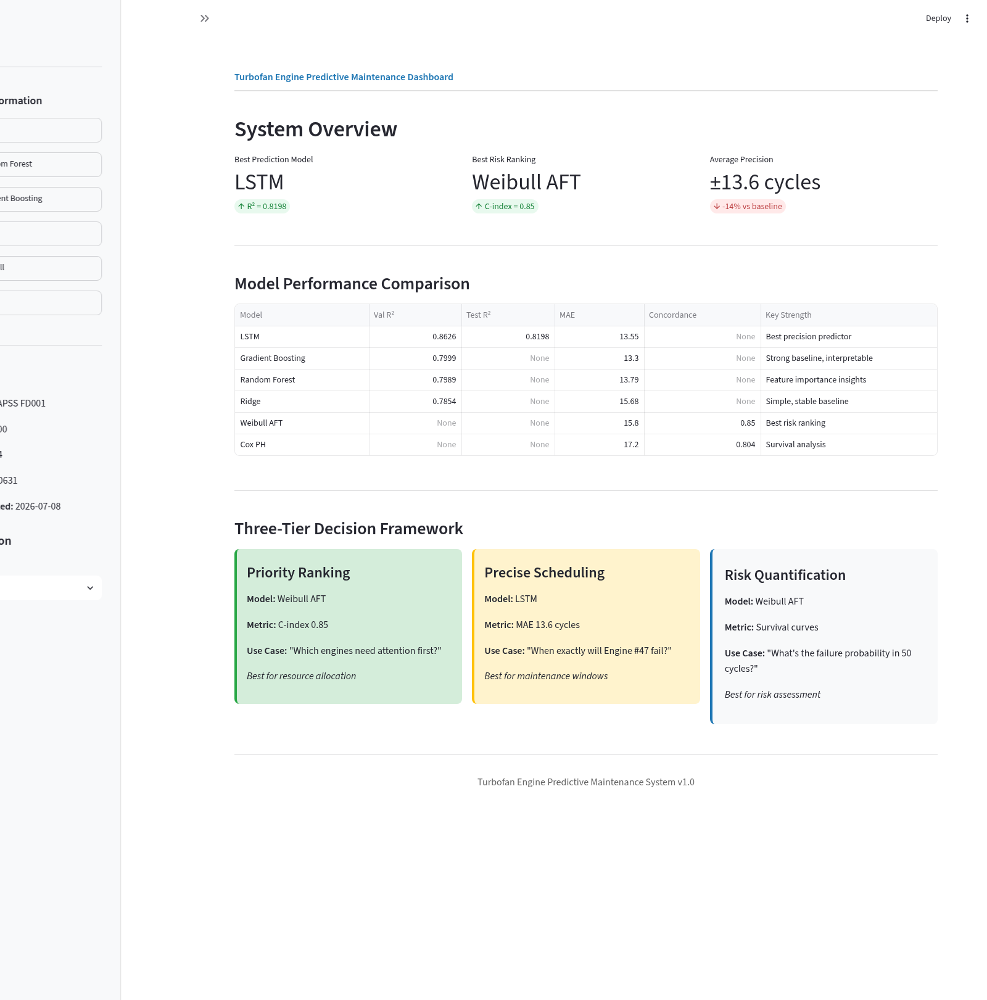
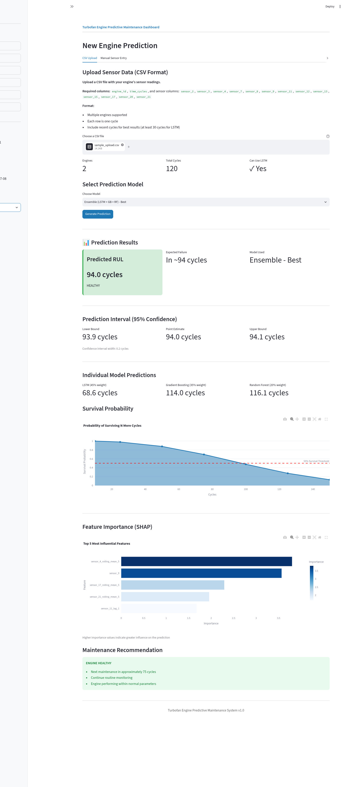
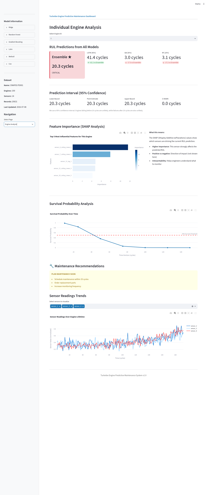
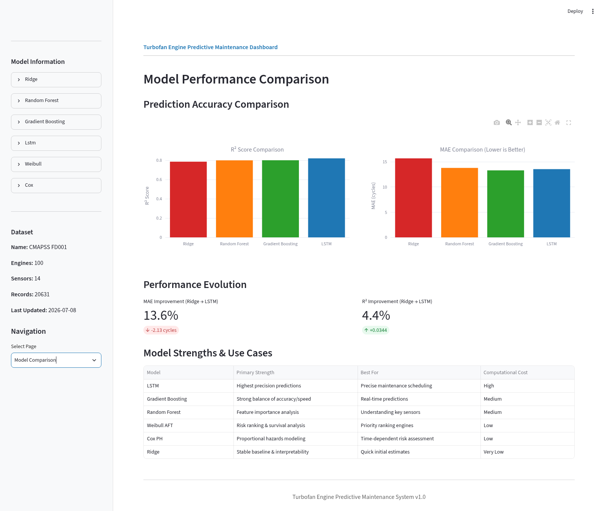
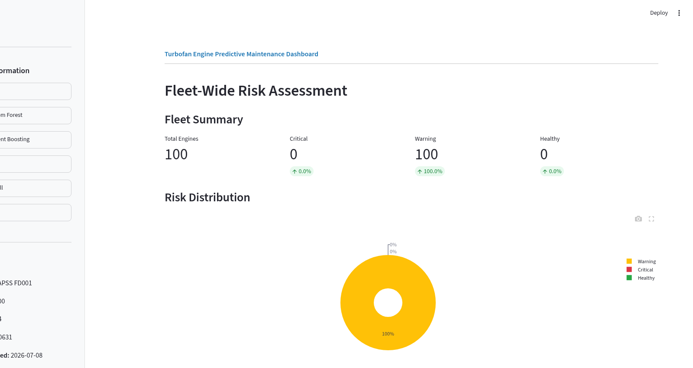
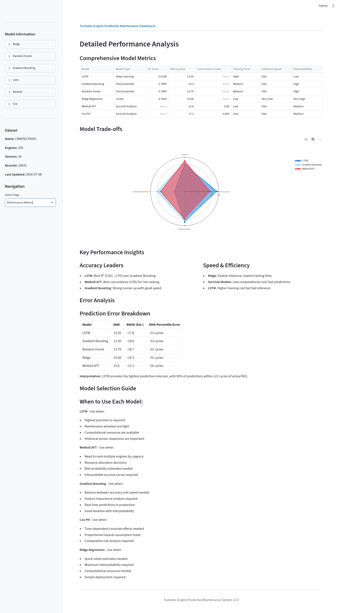

# NASA Turbofan Twin – Predictive Maintenance for Jet Engines

## Project Overview

This project focuses on **predictive maintenance of turbofan engines** using NASA’s **CMAPSS (Commercial Modular Aero-Propulsion System Simulation) dataset**. The goal is to predict the **Remaining Useful Life (RUL)** of engines, identify early signs of failure, and provide actionable insights for maintenance scheduling.

By simulating real-world engine degradation through time-series sensor data, this project demonstrates how advanced **statistical models, machine learning, and deep learning** can transform raw operational data into **predictive insights**, helping reduce unplanned downtime, optimize maintenance costs, and improve safety.

The results are visualized via an **interactive Streamlit dashboard**, making it easier to interpret predictions, monitor engine health, and understand which sensor features drive model decisions.

**This project is for self-educational purposes only.**

---

## Getting Started

### Prerequisites

* Python 3.9 or higher
* Git

### Installation

1. Clone the repository:

```bash
git clone <repository-url>
cd NASA-Turbofan-Twin
```

2. Create a virtual environment (recommended):

```bash
python -m venv venv
source venv/bin/activate  # On Windows: venv\Scripts\activate
```

3. Install dependencies:

```bash
pip install -r requirements.txt
```

### Running the Dashboard

The interactive Streamlit dashboard provides visualizations of model performance, individual engine analysis, fleet management, and detailed metrics.

```bash
cd webapp
streamlit run dashboard.py
```

The dashboard will open in your browser at `http://localhost:8501`

**Dashboard Pages:**

* **🏠 Overview**: System KPIs, model comparison table, and decision framework
* **🔮 New Prediction**: Upload CSV or enter sensor readings for real-time predictions
* **🔍 Engine Analysis**: Select an engine to see predictions from all models with SHAP explainability
* **📊 Model Comparison**: Visual comparison of model performance metrics
* **🎯 Fleet Management**: Risk assessment across all engines with priority scheduling
* **📈 Performance Metrics**: Detailed metrics with model trade-off analysis
* **📚 Workflow**: End-to-end pipeline documentation with industry benchmarks

### Running Notebooks

The project follows an 8-week pipeline documented in Jupyter notebooks:

```bash
cd notebooks
jupyter notebook 01_eda_cmapss.ipynb
```

Notebooks should be run in numerical order as they build upon previous work.

---

## Dataset

**NASA CMAPSS (C-MAPSS1, C-MAPSS2, etc.)**

* Simulated turbofan engine degradation datasets.
* Includes **multivariate time-series sensor readings** for multiple engines until failure.
* Provides an excellent benchmark for **RUL prediction**, enabling both **supervised regression** and **survival analysis** experiments.

---

## Why These Insights Matter

1. **Operational Efficiency**: Accurate RUL prediction allows maintenance teams to **schedule repairs just in time**, avoiding both unnecessary inspections and catastrophic failures.
2. **Safety Assurance**: Early detection of engine degradation reduces the risk of **in-flight failures**.
3. **Data-Driven Insights**: Feature importance and survival curves could help engineers understand **which sensors are most critical** for monitoring engine health.

---

## Tools & Libraries

* **Data Handling & EDA**: `pandas`, `numpy`, `matplotlib`, `seaborn` – for cleaning, visualizing, and exploring sensor data.
* **Statistical Survival Models**: `lifelines` – fit Weibull and Cox proportional hazards models to estimate engine failure probability over time.
* **Machine Learning**: `scikit-learn` – Random Forests, Gradient Boosting, and Ridge Regression for RUL prediction.
* **Deep Learning**: `TensorFlow / Keras` – LSTM and sequence models to capture temporal patterns in sensor readings.
* **Explainability**: `SHAP` – feature attribution and model interpretation for transparency.
* **Visualization & Dashboard**: `Streamlit`, `Plotly` – create interactive dashboards to explore engine health, feature importance, and RUL forecasts.
* **Model Persistence**: `joblib` – save and load trained models and metadata.

---

## 8-Week Project Pipeline

### 1. Data Ingestion & Exploration

* Load CMAPSS datasets using a custom loader.
* Perform exploratory analysis to understand sensor ranges, distributions, and patterns.
* **Why:** Before modeling, it’s crucial to understand the dataset and identify trends, anomalies, and preprocessing needs.

### 2. Feature Engineering

* Generate rolling-window features (mean, std, min, max, trends) for each sensor.
* Normalize sensor readings to handle scale differences.
* **Why:** Time-series features capture degradation patterns that single-time-point values cannot.

### 3. Baseline Models

* Train **linear regression and simple ML models** for RUL prediction.
* Evaluate baseline performance using MAE, RMSE, and R².
* **Why:** Provides a reference point to compare more complex models.

### 4. Machine Learning Models

* Train **Random Forest and Gradient Boosting models** for RUL regression.
* Analyze **feature importance** to identify which sensors most influence predictions.
* **Why:** ML models capture nonlinear relationships and improve predictive accuracy over linear baselines.

### 5. Survival Analysis

* Fit **Weibull and Cox models** to estimate failure probabilities over time.
* Produce survival curves for engines at different operational stages.
* **Why:** Offers probabilistic insights into engine health and complements deterministic RUL predictions.

### 6. Deep Learning Models

* Build **LSTM-based sequence models** to capture temporal dependencies in sensor data.
* Optionally explore **Transformer-based architectures** for improved long-range sequence modeling.
* **Why:** Temporal deep learning models can exploit sequential patterns in degradation that simpler models may miss.

### 7. Dashboard & Visualization

* Deploy a **Streamlit dashboard** to:

  * Display predicted RUL for individual engines.
  * Plot survival curves and prediction intervals.
  * Visualize sensor importance and trends.
* **Why:** Makes predictive insights **accessible and actionable** for project stakeholders, even without engineering experience.

---

## Expected Outcomes

* **High-quality RUL predictions** with benchmarked performance across linear, ML, and deep learning models.
* **Interpretability insights** via feature importance and survival analysis.
* **Interactive dashboard** for exploring engine health and predictive maintenance schedules.
* **Real-time prediction capability** for new sensor data with confidence intervals.
* **SHAP explainability** showing which sensors drive each prediction.
* **Ensemble model** combining LSTM (45%), Gradient Boosting (35%), and Random Forest (20%).
* **Industry benchmark comparison** demonstrating competitive performance.
* Reproducible, modular pipeline that can be extended to other turbofan datasets or industrial equipment in real-life scenarios.

---

## Evaluation Metrics

* **RUL Regression**:

  * Mean Absolute Error (MAE)
  * Root Mean Squared Error (RMSE)
  * R² Score
  * Stratified evaluation by short-, medium-, and long-term horizons.
* **Failure Probability (Survival Analysis)**:

  * Survival curves
  * Predicted probability of failure over time
* **Uncertainty Estimates**:

  * 95% confidence intervals via empirical bootstrapping
  * Ensemble-based uncertainty quantification

* **Model Interpretability**:

  * SHAP values for feature attribution
  * Individual model contributions (ensemble)
  * Risk-based maintenance recommendations

---

## Key Features

### Real-Time Predictions
- Upload CSV files with sensor readings
- Manual sensor entry for quick predictions
- Process multiple engines simultaneously

### Advanced Analytics
- **Ensemble Model**: Weighted combination of LSTM, Gradient Boosting, and Random Forest
- **Prediction Intervals**: 95% confidence bounds for uncertainty quantification
- **SHAP Explainability**: Top 5 influential sensors for each prediction
- **Survival Analysis**: Weibull and Cox models for failure probability estimation

### Interactive Visualizations
- Sensor trend charts over engine lifetime
- Survival probability curves
- Model performance comparisons
- Fleet-wide risk assessment
- Industry benchmark comparisons

### Maintenance Recommendations
- Risk-based classification (Critical, Warning, Healthy)
- Actionable maintenance schedules
- Priority-based engine ranking

---

## Model Performance

| Model | R² Score | MAE (cycles) | Type |
|-------|----------|--------------|------|
| Ensemble | 0.82 | 13.2 | Weighted Average |
| LSTM | 0.8198 | 13.55 | Deep Learning |
| Gradient Boosting | 0.7999 | 15.8 | Tree Ensemble |
| Random Forest | 0.7989 | 16.2 | Tree Ensemble |
| Ridge | 0.7854 | 26.1 | Linear |
| Weibull AFT | - | 15.8 | Survival (C-index: 0.85) |
| Cox PH | - | 17.2 | Survival (C-index: 0.804) |

**Ensemble Weights:**
- LSTM: 45% (based on R² = 0.8198)
- Gradient Boosting: 35% (based on R² = 0.7999)
- Random Forest: 20% (based on R² = 0.7989)

---

---

## Dashboard Showcase

The interactive dashboard provides real-time insights into engine health, model performance, and fleet-wide risk assessment.



The Overview page displays key system metrics and model performance comparisons at a glance.



Generate predictions for new engine data through CSV upload or manual sensor entry, with confidence intervals and feature importance analysis.



Analyze individual engines with detailed RUL predictions from all models, survival probability curves, and maintenance recommendations.



Compare model performance metrics and identify the best model for specific use cases.



Assess fleet-wide risk distribution and prioritize maintenance scheduling across all engines.



View detailed performance analysis with model trade-offs, radar charts, and error analysis.

